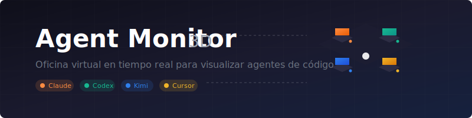

# Agent Monitor 3D (Local)

Oficina virtual 3D en tiempo real para visualizar agentes de código (Codex, Claude Code, Kimi Code, etc.) desde el navegador local.

<p align="center">
  
  
  
  
</p>

## ✨ Características

- 🏢 **Oficina 3D interactiva** con escritorios, monitores y avatares procedurales
- 🎭 **Avatares únicos** por motor (headphones para Claude, visor para Codex, etc.)
- 📊 **Dashboard en tiempo real** con métricas de agentes
- 🔔 **Sistema de notificaciones** toast para eventos importantes
- 🔍 **Búsqueda y filtrado** de agentes por nombre, proyecto o tarea
- 🌓 **Tema oscuro/claro** con persistencia
- 🔄 **Reconexión automática** SSE con backoff exponencial
- 🎨 **UI moderna** con glassmorphism y animaciones fluidas

## 🚀 Requisitos

- Node.js 18+

## 📦 Instalación y uso

```bash
cd /Users/dr.alexmitre/Desktop/agent_monitor
node server/index.js
```

Abre: `http://localhost:4321`

## 🎯 Agentes soportados

| Agente | Icono | Color | Identificación |
|--------|-------|-------|----------------|
| Claude Code |  | 🟠 Naranja | `claude` |
| Codex |  | 🟢 Verde | `codex` |
| Kimi Code |  | 🔵 Azul | `kimi` |
| Cursor |  | 🟡 Amarillo | `cursor` |

## 📡 Detección automática

El backend escanea procesos del sistema cada ~2.5s y detecta:

- `claude` / `claude-code`
- `codex`
- `kimi`
- `cursor`

Cuando arrancas cualquiera de estos CLIs, aparece automáticamente en la oficina 3D.

## 🛠️ API

### `GET /health`
Estado del servidor.

### `GET /api/state`
Snapshot actual de agentes y eventos.

### `GET /events`
Stream SSE de eventos en tiempo real.

### `POST /api/agent/event`
Reportar evento manual de agente externo:

```bash
node scripts/emit-agent-event.mjs "Nombre" "Tarea" [status] [project] [engine] [id1,id2]
```

Ejemplo:
```bash
node scripts/emit-agent-event.mjs "Codex Planner" "Dividiendo tareas del sprint" working agent_monitor codex
```

**Body JSON:**
```json
{
  "name": "Kimi Code",
  "task": "Analizando logs",
  "status": "working",
  "project": "agent_monitor",
  "engine": "kimi",
  "relations": ["codex-123"]
}
```

## 🎨 Assets incluidos

| Asset | Descripción |
|-------|-------------|
| `logo.svg` | Logo principal con oficina isométrica |
| `favicon.svg` | Favicon optimizado |
| `icon-claude.svg` | Icono orbital para Claude |
| `icon-codex.svg` | Icono de brackets para Codex |
| `icon-kimi.svg` | Icono de ondas para Kimi |
| `icon-cursor.svg` | Icono de mira para Cursor |
| `banner.svg` | Banner para README/GitHub |

## 🏗️ Arquitectura

```
┌─────────────────────────────────────────┐
│           Navegador (Frontend)          │
│  ┌─────────────┐  ┌─────────────────┐  │
│  │  Three.js   │  │  UI Reactiva    │  │
│  │  (Oficina)  │  │  (Glassmorphism)│  │
│  └─────────────┘  └─────────────────┘  │
└─────────────────────────────────────────┘
                   │
                   │ SSE / HTTP
                   ▼
┌─────────────────────────────────────────┐
│         Node.js Backend                 │
│  ┌─────────────┐  ┌─────────────────┐  │
│  │  Scanner    │  │  Event Bus      │  │
│  │  (ps aux)   │  │  (SSE)          │  │
│  └─────────────┘  └─────────────────┘  │
└─────────────────────────────────────────┘
```

## 🎮 Controles 3D

- **Orbitar**: Click + arrastrar
- **Zoom**: Scroll
- **Seleccionar agente**: Click en el avatar
- **Límites**: Ángulo polar restringido para mantener vista cenital

## 🔧 Variables de entorno

| Variable | Default | Descripción |
|----------|---------|-------------|
| `PORT` | `4321` | Puerto del servidor |
| `AGENT_MONITOR_URL` | `http://localhost:4321` | URL base para scripts |

## 📝 Changelog

### v0.3.0
- ✨ Sistema de notificaciones toast
- ✨ Toggle tema oscuro/claro
- ✨ Búsqueda de agentes
- ✨ Reconexión SSE robusta
- ✨ Iconos SVG personalizados para cada motor
- 🎨 UI glassmorphism mejorada
- 🐛 Fixes de animaciones 3D

### v0.2.0
- ✨ Avatares 3D procedurales únicos por motor
- ✨ Sistema de hologramas flotantes
- ✨ Líneas de relación entre agentes
- ✨ Timeline de eventos en vivo

### v0.1.0
- ✨ Versión inicial
- ✨ Detección automática de procesos
- ✨ Stream SSE básico
